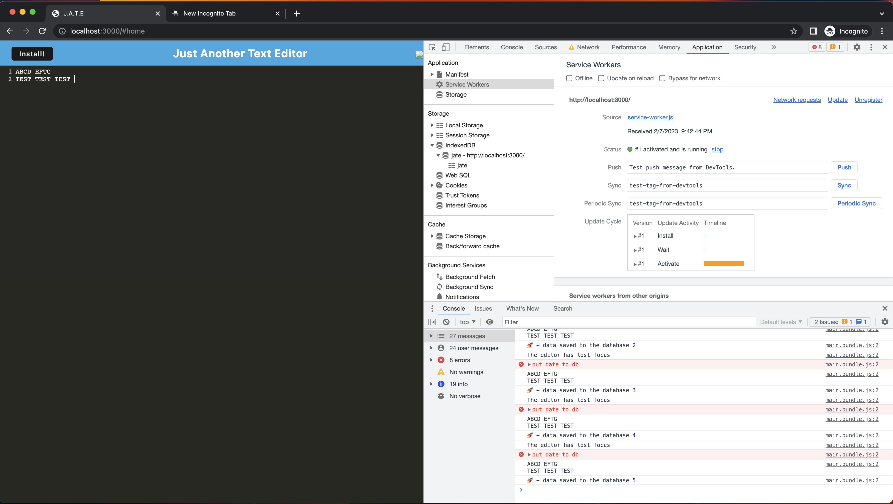
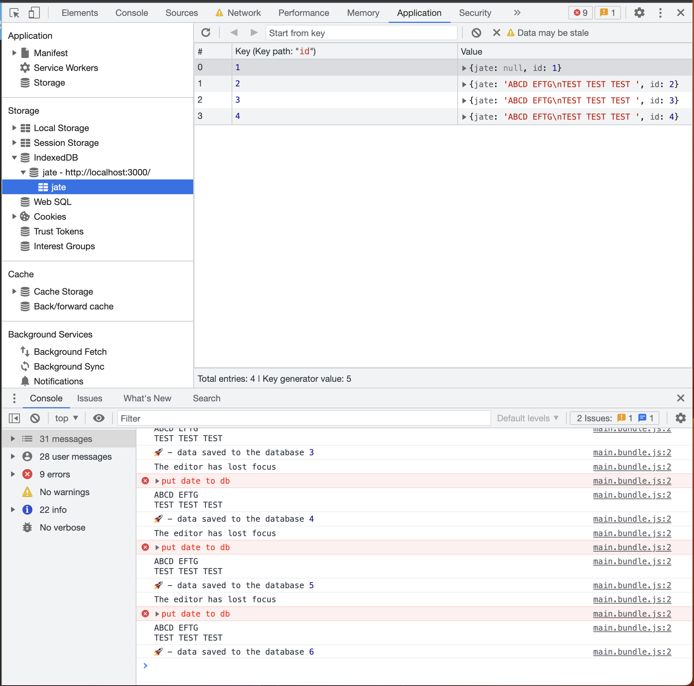

# text-editor-pwa
A Text Editor in a single-page app that meets Progressive Web App criteria

## Description

This projects started with a pre-built starter code base.  The student's responsibility is to modify and add the necessary components to satisfy the high-leve requirements of a Progressive Web App (PWA). It implements client-side storage using the *idb* npm package, a wrapper around *IndexedDB*, to enable offline use.

## Table of Contents (Optional)

If your README is long, add a table of contents to make it easy for users to find what they need.

- [Installation](#installation)
- [Usage](#usage)
- [License](#license)

## Installation

- Clone the repository
- Run `npm install` to add dependencies
- Run `npm run build` to create the package

## Usage

- Run `npm start` to start the app.
- Browse to `http://localhost:3000` in your browser
- enter text in the editor window
- Open the browser's developer tools to observe the service worker and IndexedDB data structure.
- Check the *offline* box on the Service Worker area and refresh the web page to see if working offline.

**Screen Shots**

**Deployed Application**
[App on Heroku](https://floating-chamber-38991.herokuapp.com)
 
## License

[MIT License](LICENSE)